# Fault-Robustness Benchmark for Cooperative Perception

Injects realistic sensor, pose and V2X-link faults into published cooperative
perception models and measures how much each one degrades.

## Approach

The baselines are the official released models, run through their own authors'
code at their own published settings. We do not retrain or reimplement them.
A thin per-dataset adapter maps each sample into a canonical
`CooperativeSample` / `AgentFrame` form, the fault injectors corrupt that
canonical form, and the adapter hands the sample back to the unmodified
official pipeline, which computes AP exactly as it would on clean data.
Degradation is then the difference between a model's faulty AP and its own
fresh clean control, measured in the same session with the same seed.

Three properties carry the validity of a number out of this pipeline:

1. **Fire-point correctness.** Faults are applied before the official code
   derives anything from the corrupted quantity. For OpenCOOD that means the
   agent-to-ego transformation matrix is recomputed from the perturbed poses;
   perturbing the raw pose after `retrieve_base_data` returns would be a
   silent no-op, which is the failure mode a naive wrapper hits.
2. **Stateless per-sample seeding.** Every draw derives from
   `SeedSequence(base_seed, spawn_key=(frame, agent, stage))`, never from
   injector state, so results are identical at any DataLoader worker count and
   every logged draw is independently re-derivable.
3. **Audit trail.** Every applied fault writes one row (frame, agent, stage,
   seed, drawn values) to `injection_summary.csv`. A clean run logs zero rows.

Comparison is within each model against its own clean baseline. Cross-model
ranking is not valid here: the released checkpoints differ in training
protocol and data, so a table ranking them against each other would measure
training, not robustness.

## Verified baselines

Official code, released checkpoints, our staged data, each model at its own
authors' setting on its native dataset. All three are LiDAR-only.

| model | dataset | setting | AP@0.5 / AP@0.7 | published |
|---|---|---|---|---|
| V2X-ViT | V2XSet | Noisy | 0.84 / 0.62 | 0.836 / 0.614 |
| CoBEVT | V2XSet | Perfect | 0.85 / 0.66 | 0.849 / 0.660 |
| Where2comm | OPV2V | Noisy | 0.86 / 0.60 | no published oracle, ungraded |

When our injectors run, OpenCOOD's built-in `wild_setting` noise
(`loc_err`, `async`) is forced off and the clean control is re-measured at
that setting, so the AP delta is attributable to exactly one fault source.

## Fault injectors (7)

Dataset-agnostic, operating on the canonical form only. Per-agent modality
routing is enforced by a shared gate (`src/adapters/modality.py`): LiDAR
faults reach only LiDAR-carrying agents, camera faults only camera-carrying
agents, and an injector with no valid target logs an explicit skip rather
than silently doing nothing.

| injector | fault | verified to inject by |
|---|---|---|
| PoseError | Gaussian/Laplace localisation noise on shared poses (V2X-ViT protocol) | PoC below; per-draw log matches theory (mean abs dx 0.1602 vs 0.1596) |
| CommLatency | per-agent stale frames, scene-clamped on Griffin | gate tests |
| AgentDrop | whole-agent transmission loss, i.i.d. | gate tests |
| MissingModality | Bernoulli sensor blackout (LiDAR on OpenCOOD, cameras on the Griffin drone) | gate tests |
| PointsReduce | uniform point dropout, keeps 30/20/10 % at severity 1/2/3 | exact fractions, independent permutations per frame and agent |
| LidarFog | Beer-Lambert attenuation plus fog scatter (MultiCorrupt physics) | real-cloud runs: all intensities change, points move |
| LidarSnow | Hahner snowfall simulation: attenuate, scatter, remove | real-cloud runs on V2XSet and Griffin |

Severity for the MultiCorrupt-derived injectors is 1/2/3 (Table I); 4 and 5
raise. All injectors leave the global numpy RNG untouched (verbatim backends
that reseed it are bracketed with save/restore), which is what keeps the
faulty run comparable to the clean one.

Not in the OpenCOOD set: camera injectors (the three baselines are
LiDAR-only; the modality gate blocks them structurally, and they are used on
Griffin instead), BeamReduce (needs a ring column these clouds lack),
BandwidthLimit and TemporalMisalignment (excluded during injector
verification).

A historical note recorded because it cost real effort: fog and snow were
first believed to no-op on OPV2V/V2XSet "because CARLA clouds have zero
intensity". The clouds have real intensity; it is stored bit-packed in the
`.pcd` `rgb` field, and this repo's own reader was zero-filling it. The
reader now unpacks it bit-identically to OpenCOOD's, and fog/snow inject on
these datasets.

## What the faults look like

Every injector at all three tested severities, one representative dataset
each. All of it is generated by `notebooks/fault_visualisation.py` from the
**same injectors and adapters the sweep uses** (seed 1234), so each frame is
a real injected sample. Full set, including the other datasets and the MP4
animations: `results/fault_injector_visualisation/` (see its `INDEX.md`).

Deltas quoted below are CoBEVT on V2XSet, AP@0.5 / AP@0.7 against its own
same-session clean control.

### Cooperative faults (V2X link)

These are the faults the benchmark exists for, and none of them are visible
in a single-agent view. Points are coloured **by agent**, ego always blue.

**PoseError**: GPS/IMU error corrupts the *shared* pose, so a
collaborator's whole cloud lands rigidly misaligned in the ego frame. White
quivers are the displacement field; mean displacement grows with sigma.
Measured: `-0.015/-0.064` → `-0.073/-0.197` → `-0.162/-0.303`.

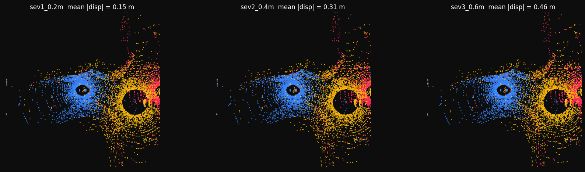

**CommLatency**: the collaborator's data arrives 1–3 frames stale, so
moving objects in its cloud trail their live positions. Measured:
`-0.014/-0.068` → `-0.117/-0.190` → `-0.247/-0.266`.

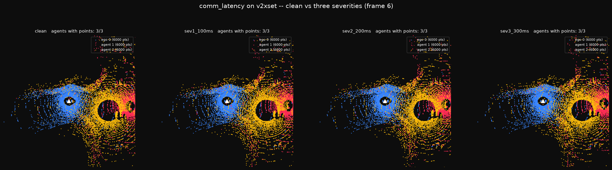

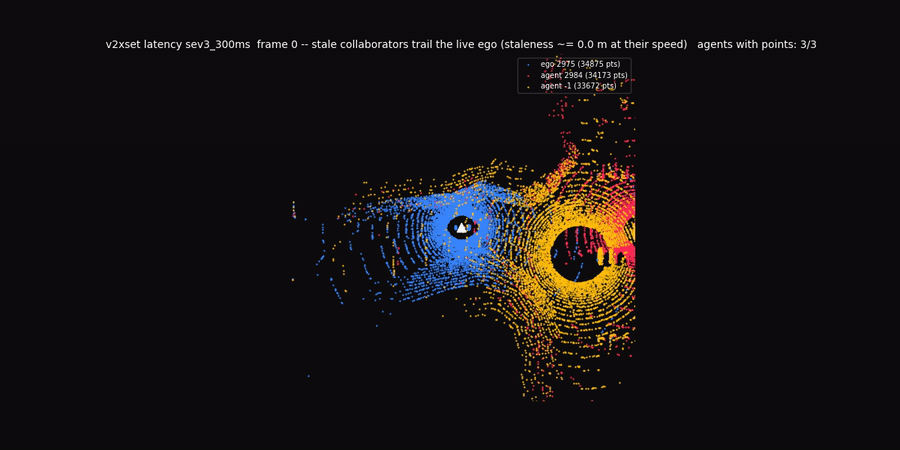

**AgentDrop**: a transmission is lost entirely: the agent's colour vanishes
and its node leaves the fusion graph. Measured (3-agent scenes):
`-0.025/-0.027` → `-0.059/-0.076` → `-0.096/-0.128`.

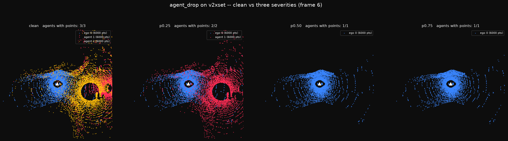

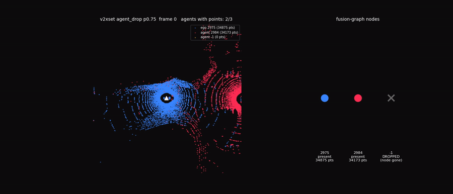

**MissingModality**: the sensor dies but the agent *stays in the fusion
graph*: pose known, zero points. Contrast with AgentDrop above: the node is
still there. Measured slightly **worse** than dropping the agent outright at
equal p, which is the point: an empty agent still consumes fusion attention.
`-0.032/-0.034` → `-0.069/-0.075` → `-0.116/-0.124`.

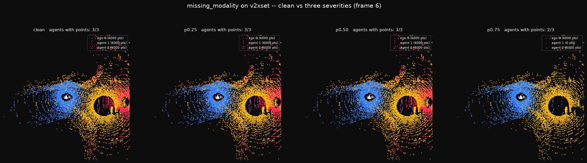

### LiDAR faults (sensor and environment)

**PointsReduce**: uniform dropout keeping 30 / 20 / 10 % of returns.
Measured: `-0.138/-0.170` → `-0.203/-0.238` → `-0.336/-0.355`.

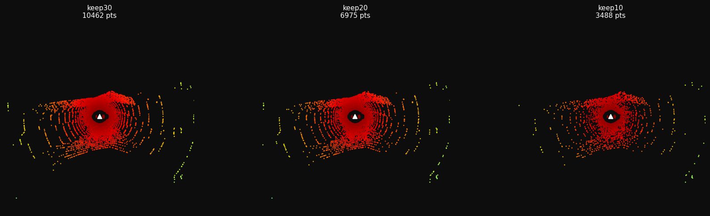

**LidarFog**: Beer-Lambert attenuation plus fog backscatter. Intensity
(viridis) dims as near-range scatter appears. **The most destructive fault we
measured**: `-0.693/-0.551` → `-0.840/-0.657` → `-0.849/-0.660`, i.e. total
collapse of a clean-trained detector.

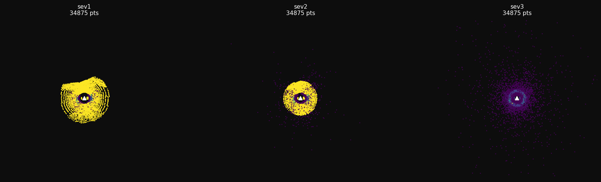

**LidarSnow**: Hahner snowfall physics: attenuate, scatter, remove.
Measured: `-0.403/-0.394` → `-0.424/-0.404` → `-0.491/-0.448`.

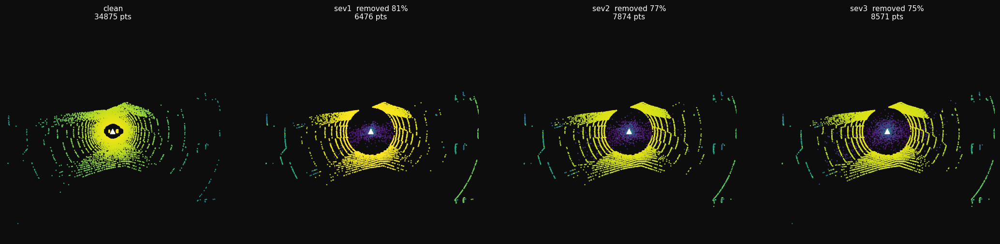

The removal fraction **inverts** with severity (0.399 → 0.323 → 0.290) while
AP degrades monotonically, so severity acts through scatter corruption, not
removal volume. Point counts alone would mis-rank these conditions:

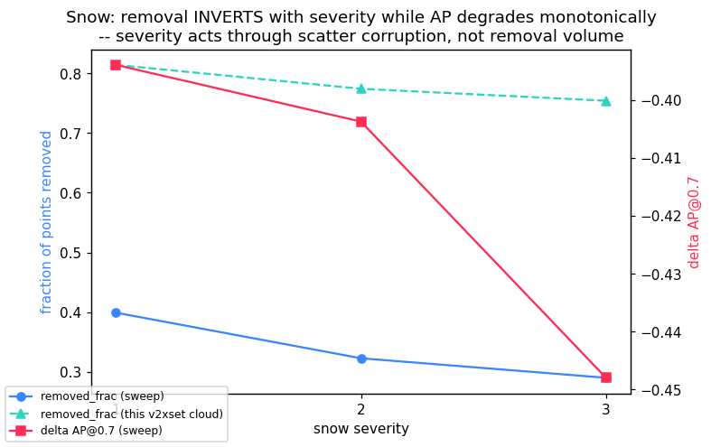

### Camera and cross-modal faults (Griffin)

The three OpenCOOD baselines are LiDAR-only, so these run on Griffin, where
the vehicle carries cameras and the drone is camera-only. **Not measured**:
Griffin has no trained cooperative model here yet (see status below); these
are verified-to-inject, not verified-to-degrade.

**Brightness / Darkness / camera Fog / camera Snow**: MultiCorrupt camera
corruptions, rows [vehicle front, drone bottom] × columns [clean, sev 1-3].

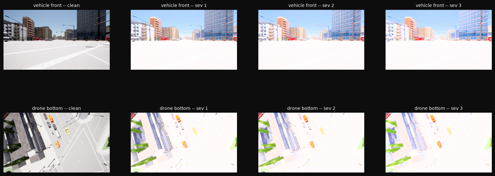
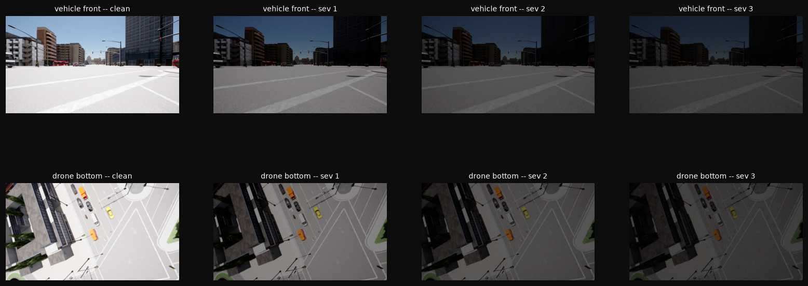
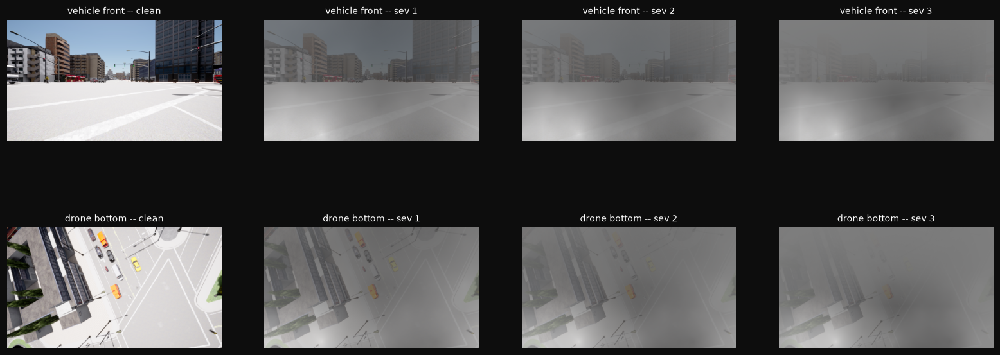
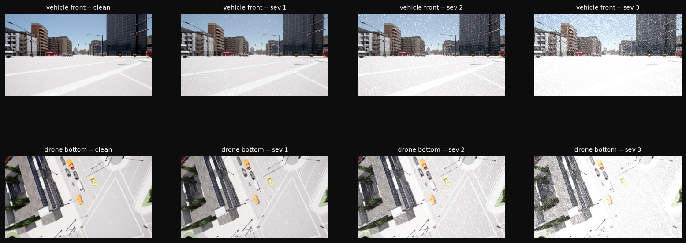

**SensorOcclusion**: lens contamination: dirt, scratch, glass crack, at the
achieved coverage shown in each title.

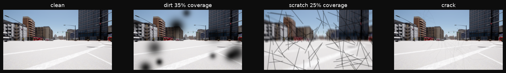

**TemporalMisalignment**: current LiDAR paired with a *stale image*. The
projected points sit where objects **are**; the image shows where they
**were**. Staleness annotated in metres (v·dt).

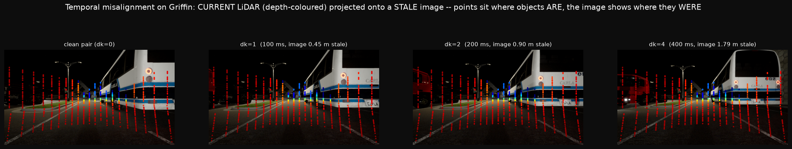

**BeamReduce**: scan-line thinning, keeping 1/2, 1/4, 1/8 of the beams.
Griffin-native (elevation binning); the strict MultiCorrupt variant needs a
ring column that CARLA clouds do not carry.

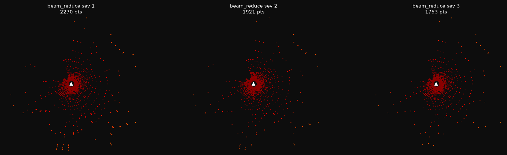

## Supported datasets

| dataset | adapter | state |
|---|---|---|
| V2XSet / OPV2V (OpenCOOD) | `src/adapters/opencood.py` + `src/adapters/runtime.py` | validated end to end, measurement-ready |
| Griffin (aerial-ground) | `src/adapters/griffin.py` | built and gate-verified (34 checks); measurement pending a trained Griffin model |

Griffin routing differs by construction: every scene is one LiDAR+camera
vehicle (the ego) plus one camera-only drone, so LiDAR faults target the
vehicle, camera faults both agents, and AgentDrop / CommLatency /
MissingModality target the drone. PoseError is not wired on Griffin.

## How to run

Two environments, deliberately separate:

- `opencood-official` (conda, Python 3.7, torch 1.12.1+cu113): the wrapper
  runs inside the same environment that produced the verified baselines.
  Requires the official repos (`~/opencood-official`, `~/v2xvit-official`)
  and released checkpoints (`~/opencood-eval/<model>/`); paths are this
  cluster's layout.
- `.venv-hpc` (Python 3.13, built from `requirements-hpc.lock.txt`, which is
  the authoritative lock): the standalone toolkit, the Griffin adapter and
  the reimplementation packages. When touching it, resolve against a freeze
  constraint so nothing pinned can move.

Login-node gates (seconds to minutes, no GPU):

```bash
# OpenCOOD adapter round trip, modality gate, seeding        (py3.7 env)
python tools/test_gate1.py
# real-data smoke against a staged V2XSet scenario           (py3.7 env)
python tools/smoke_adapter.py
# Griffin: round trip, per-agent routing, skips, scene clamp (.venv-hpc)
python tools/test_griffin_gates.py
```

One condition through the official pipeline (`tools/fi_inference.py` is the
only file that imports OpenCOOD; it swaps the dataset class in
`datasets.__all__` and calls the unmodified official `inference.main()`):

```bash
python tools/fi_inference.py \
    --model_dir ~/opencood-eval/cobevt \
    --fusion_method intermediate \
    --fi_condition pose_sev2 \
    --fi_seed 1234 \
    --fi_out results/pose_sev2
```

Conditions live in the `CONDITIONS` dict in `tools/fi_inference.py`; a sweep
is additional entries there, each a `FaultSpec`:

```python
CONDITIONS = {
    'official':  None,                                     # unwrapped control
    'clean':     dict(),                                   # null pipeline
    'pose_sev2': dict(pose_error={'sigma_xy': 0.2, 'sigma_heading': 0.2}),
    # sweep entries follow the same shape:
    'fog_sev2':  dict(lidar_fog={'severity': 2}),
    'snow_sev2': dict(lidar_snow={'severity': 2, 'mount_height': 1.9}),
    'drop_50':   dict(agent_drop={'p_drop': 0.5}),
    'points_s2': dict(points_reduce={'severity': 2}),
}
```

On the cluster, `tools/slurm/fi_poc_cobevt.sbatch` is the pattern: one job
runs the unwrapped control, a null-wrapper pass, a determinism repeat and the
fault condition, so all four share a session, seed and worker count. Each run
writes `fi_result.json` (full-precision AP), `eval.yaml` and the merged
`injection_summary.csv`.

Griffin, in-memory (no model yet, so no AP):

```python
from src.adapters.griffin import FaultedGriffinDataset, GriffinFaultSpec
from src.datasets import load_dataset

ds = load_dataset('griffin', veh_root=..., drone_root=...)
spec = GriffinFaultSpec(seed=1234, lidar_fog={'severity': 2}, log_dir='out')
sample = FaultedGriffinDataset(ds, spec).get_sample(0)
```

## Repository layout

```
src/                    standalone fault-injection toolkit
  datasets/             canonical sample model + per-dataset loaders
  fault_injectors/      the injectors and verbatim MultiCorrupt backends
  adapters/             the wrapper layer:
    opencood.py         dict <-> canonical translation, transformation-matrix
                        recompute, pass-through asserts
    runtime.py          make_faulty_dataset(): hooks OpenCOOD's dataset class
    modality.py         shared per-agent modality gate
    griffin.py          Griffin routing (per-agent, scene-clamped latency)
tools/
  fi_inference.py       the only OpenCOOD-importing file; runs official eval
  test_gate1.py         OpenCOOD adapter gates
  test_griffin_gates.py Griffin adapter gates
  smoke_adapter.py      real-data smoke
  slurm/                job scripts (GPU pinned; wild_setting forced off)
cpbench/                shared core for the reimplementation packages
corabench/              from-scratch CoRA reimplementation (no released code
                        or weights exist); the basis for our own architecture
lgcpbench/              LGCP protocol simulation
cobevtbench/ w2cbench/  reimplementation packages with fault surfaces; not the
                        baseline path (official checkpoints are)
v2xvitbench/            parked reimplementation; superseded as a baseline by
                        the official V2X-ViT checkpoint
docs/                   design contracts, wrapper design record
                        (fault_wrapper_design.md), Griffin adapter record
```

The layering rule (`src <- cpbench <- paper packages`, siblings never import
each other) is enforced by `cpbench/tests/test_layering.py`. The adapter
layer adds one rule on top: nothing in the official baseline path imports
from this repository except `tools/fi_inference.py`, and the Griffin files
are imported by nothing on the OpenCOOD path.

## Current status

What is measured:

- The wrapper is validated end to end on CoBEVT/V2XSet: a fresh clean control
  reproduced the verified baseline (0.849266 / 0.660585 at full precision);
  the null-pipeline wrapper matched it to within the measured run-to-run
  noise floor (differences of 6.5e-05 / 2.1e-04 against a floor of
  1.8e-05 / 9.4e-05 from an identical repeat); the fault fired on all 2834
  frames with zero ego perturbations.
- One fault result exists: PoseError at sigma_xy 0.2 m, sigma_heading 0.2 deg
  on CoBEVT, AP@0.5 -0.0148 and AP@0.7 -0.0639 against the same-session
  clean control. The tight-IoU column degrading roughly 4x harder is the
  expected signature of small spatial misalignment.

What is not:

- The full fault sweep (7 injectors x severities x 3 models) has not run.
- Griffin has no trained model yet, so the Griffin adapter is gate-verified
  but unmeasured.
- LidarSnow's default severity mapping is uncalibrated for Griffin's sparse
  clouds: severities 1/2/3 all remove 83 to 85 % of points (the noise-floor
  stage dominates), a flat curve that needs recalibration review before snow
  enters a Griffin sweep. On V2XSet clouds pass `mount_height=1.9`.
- Where2comm's clean baseline is ungraded (no published number at its
  setting). When reading Where2comm results, report bandwidth beside AP:
  a degraded sensor lowers confidence, fewer cells transmit, and the
  efficiency column improves exactly when perception starts failing.

## Links

- CoBEVT: https://arxiv.org/abs/2207.02202 and https://github.com/DerrickXuNu/CoBEVT
- Where2comm: https://arxiv.org/abs/2209.12836 and https://github.com/MediaBrain-SJTU/Where2comm
- V2X-ViT: https://arxiv.org/abs/2203.10638 and https://github.com/DerrickXuNu/v2x-vit
- OPV2V and OpenCOOD: https://github.com/DerrickXuNu/OpenCOOD
- Griffin: https://arxiv.org/abs/2503.06983 and https://huggingface.co/datasets/wjh-svm/Griffin
- MultiCorrupt: https://github.com/ika-rwth-aachen/MultiCorrupt and https://arxiv.org/abs/2402.11677
- CoRA: https://arxiv.org/abs/2512.13191
- LGCP: https://arxiv.org/abs/2601.12749
- DAIR-V2X: https://github.com/AIR-THU/DAIR-V2X
